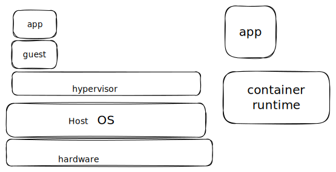

# 🥫 Introduction to containers

### Máquina Virtual:

Emulación del sistema operativo, esta virtualización se realiza por medio de Hypervisor, permite hacer el uso de las simulaciones donde se asignan ciertos recursos de nuestra máquina real a la máquina virtual. En la virtualización se deciden cuantos cores se utilizan (reservan) para que los use la máquina virtual, es para optimizar los recursos de manera eficiente ya que se aislan los recursos de mejor manera.

El nucleo o el socket fisico es el CPU. y tiene diferentes cores que sirven para desplegar de manera simultanea

En un servidor se tiene más de un procesador y cada uno tiene sus propios Cores.

**Ejemplo.**

<table><thead><tr><th width="120"></th><th width="99.33333333333331">PC total</th><th>Virtualización</th></tr></thead><tbody><tr><td>CPU</td><td>8</td><td>2</td></tr><tr><td>RAM</td><td>16 GB</td><td>4 GB</td></tr><tr><td>Discos</td><td>1TB DD</td><td>50 GB (Windows), 10 GB (Linux)</td></tr></tbody></table>

## Container

### What containers are?

* A form of virtualization technology
  * No necesitan de asignación de recursos como en la virtualización.
* Allows developers to package appplications and their dependencies into a single unit
  * Permite ejecutar, sin necesidad de afectar todo el dispositivo, sin afectar al instalar la dependencia.
* They are isolated and self-sufficient
  * &#x20;Y es posible dado que se mantiene aislado de los contenedores y es autosuficciente

<mark style="color:yellow;">**No es necesario elegir una u otra, son complementarias, se pueden usar ambas, y se pueden usar ambas al mismo tiempo.**</mark>

#### ¿Cuál es la diferencia entre máquina virtual y contenedor?

<figure><figcaption></figcaption></figure>



En lugar de Hypervisor, el contenedor utiliza un <mark style="color:red;">**Container runtime**</mark> que es el es el software que permite alojar a los contenedores dentro del hypervisor.

En las máquinas virtuales se encuentran ligadas completamente al hw, al correr la MV puede no correr, falla y no es portable, eso es mejor en contenedores

KErnel de Linux generalmente es igual en todos.

Sin importar el SO, los contenedores corren de manera adecuada, a excepci{on de Windows, porque no tiene un kernel como tal.


### Containers advantages


* Portability: Ejecutar en casi cualquier so y hw
* Isolation: Instalar todo en un solo paquete, instalado en un pequeño SO base, sin afectar lo demás. Es importante porque hay microservicios que se hacen en diversos lenguajes y se aisla el ambiente para solo ejecutar por partes.
* Scalability: Una de las características mejor otorgadas que tiene. Hay dos formas de hacerlo,&#x20;
  * Vertical: YA se tiene la maquina virtual y solo se le agregan mas recursos, se agrega a lo que ya existen, poor ejemplo los recursos
  * Horizontal: colocar un nodo extrae al hypervisor, si un contenedor ya no da las respuestas, entonce se crea otro contenedor.
* Efficiency: Linux, 7gb para instalar y Windows 50 GB, en Ubuntu son 250 MB, LA eficiencia que consume los recursos es bajísima. micras de unidad de una CPU (Cada CPU tiene 1000 mi y  250-500mi) y de ello solo se ocupa esto ultimo. YA que cada contendor se realiza como un proceso independinte
* Inmutabilidad en MV:&#x20;
* Version control MAs sencillo,  Se puede usar  Docker file, file tipo configuration and you can say what chould have that image.  Es fácil trackear la informacion ---Infraestructura como codigo
* Dependency Management: Puedes definir que dependencias puede tener el contenedor de manera independiente

### Docker architecture

Runtime mas famoso es Docker, también existe Podmari, CRI-O, Container

* Docker ddaemon: DEmonio, que se ejecuta y permite la creación de contenedores imagenes etc.
* Images: Imágenes equivalente de MV de un SO, que permite ejecutar el contenedor. Se guardan en containers reddis ? Docker Hub, otros son ger o Quay.io
* Registry: REgistry obtener la imagen y desplegarla como contenedor? si funciona para
* Client: Cliente, permite interactuar con el demonio, este es la linea de comandos


Licencias de GNU y demás, de software libre, Docker es gratis de usar, pero ya no se puede usar como antes.&#x20;

4 principios: estudiar, modificar código, código distribuirlo, obtener ganancias mientras sea libre.


## 2. Working with containers

Documentación: [https://docs.docker.com/engine/install/fedora/](https://docs.docker.com/engine/install/fedora/)

Dar de alta repositorios

```
sudo dnf -y install dnf-plugins-corsudo dnf -y install dnf-plugins-core
```

Agregar repositorio


```
sudo dnf config-manager --add-repo https://download.docker.com/linux/fedora/docker-ce.repo
```


<figure><figcaption></figcaption></figure>

Instalación de docker, el plugin de compose permite multples contenedores en una unica expresión? que se reemplaza con kubernetes.


```
sudo dnf install docker-ce docker-ce-cli containerd.io docker-buildx-plugin docker-compose-plugin
```


Una vez instalado, se debe ejecutar el servicio o demonio, system di

```
sudo systemctl start docker
```

Si queremos que se ejecute cada que usemos la máquina virtual

```
sudo systemctl start docker --now docker
```

Para verificar que este bien

```
sudo systemctl status docker
```

Si esta en <mark style="color:green;">verde</mark> todo esta bien.

<figure><figcaption><p>Se muestra el docker funcionando</p></figcaption></figure>

Para saber la versión

```
docker --version
```

Para trabajar en la obtención de imágenes desde el registry de docker hub

<pre><code><strong>docker pull ubuntu: latest
</strong></code></pre>

Si no se puede se ocupan los permisos de usuarios&#x20;

```
sudo usermod Nombreusuario -aG docker
```

Permiso para poder leer sus archivos en ese grupo, recuerda reinicar la terminal despues de esto

```
sudo docker pull ubuntu: latest
```

Como saber que se descargo la imagen.&#x20;

```
sudo docker images
```

<figure><figcaption></figcaption></figure>

Eliminar la imagen

```
sudo docker image rm ubuntu:latest
```


#### ¿Cómo levantar un contenedor?

Los contenedores son efímeros no están fabricados para guardar cosas, si se muere un contenedor se levanta otro. Cuando no funcionan se mueren, puede ser debido a una mala configuración, los tags ayudan a regresar a alguna version anterior. &#x20;


&#x20;Se ejecute en background y libere el prompt para seguir ejecutando,&#x20;

_--name_ es para colocar el nosmbre que queremos que aparezca para la imagen.

```
sudo docker run -ti -d --name ubuntu ubuntu:latest
```

Para saber que comando se esta ejecutando

```
sudo docker ps
```

<figure><figcaption></figcaption></figure>

Puertos UDP TCP, puertos de servicios mas importantes HTTPS, http, dns 53, y el 22

```
sudo docker run -ti - d --name nginx nginx:latest
```

<figure><figcaption><p>En la imagen se puede ver la salida obtenida de <code>sudo docker ps</code> conel puerto que utiliza nginx</p></figcaption></figure>

Si se da un curl se da para poder obtener una respuesta de una url, o generalmente para probar API, microservicio que realiza create, uodate, read, delete... localhost/create... Dado que el puerto esta expuesto pero fuera dado que esta aislado no hará nada

Con el siguiente comando se muestra el numero del contenedor, así es posible entrar localmente y poder realizar ahora sí el comando curl

```
sudo docker exec -ti ngnix /bin/bash
curl localhost
```

<figure><figcaption></figcaption></figure>

En este caso el curl responde al servicio, a un html, da la bienvenida. Porque no están expuestos los puertos, por eso no se ve, **Port forwading,** si no se realiza esto se muestra un fallo en la conexión

#### ¿Cómo exponer/mapear el puerto? PORT FORWADING

1. Matar el contenedor actual y levantar uno expuesto

<pre><code>sudo docker rm -f nginx
<strong>sudo docker ps
</strong>sudo docker run -ti -d -p 80:80 --name nginx nginx:latest 
</code></pre>

Del lado izquierda es el de la pc o por cual puerto se va a conectar, del lado derecha es el puerto del contenedor.&#x20;

<mark style="color:red;">**Cuidado con el puerto usado:**</mark> <mark style="color:red;"></mark><mark style="color:red;">Es importante que el puerto no se este usando por el Sistema Operativo.</mark>

<mark style="color:blue;">Recordemos la dirección de localhost es 127.0.0.1</mark>

<mark style="color:blue;">DNS: Forward y Reverse, IP <-> nombre, esto es Google.com <-> 187.x.x.x</mark>&#x20;

Con el siguiente comando es posible ver todos los containers que se han creado:

```
sudo docker ps -a 
```

<figure><figcaption><p>Comodín 0.0.0.0 que indica que todas las direcciones IP se dirigan al puerto 80.</p></figcaption></figure>

<mark style="color:green;">TCP verificación de paquete, UDP</mark>

<mark style="color:green;">Puerto 53 DNS, VPN</mark>

Cada container tiene un log y te dice porque no se ejecuta, o que pasó con el container.

```
sudo docker logs nginx
```

<figure><figcaption></figcaption></figure>

```
curl localhost:80
```

<figure><figcaption></figcaption></figure>

Una vez realizado, desde el navegador colocar <mark style="color:blue;">**localhost**</mark> y deberá mostrar lo siguiente:

<figure><figcaption></figcaption></figure>

Levantar y apagar

```
sudo docker stop nginx
sudo docker start nginx
```

En docker hub se muestran las imágenes, vienen los tags, es ala practica usar latest para ello, por si no funciona en otras versiones. Se muestra la documentación oficial y tags, tags versión de la imagen, pueden venir con nombre o con números&#x20;

Dado que no se puede guardar ningún archivos es que se pueden usar volúmenes.

Para reiniciar el demonio:

```
sudo systemctl restart docker
```

#### Docker file&#x20;

Contiene las instrucciones para poder crear imágenes personalizadas.


```
mkdir python-app
cd python-app/
```

Crear un archivo de python se usa cualquiera de estas dos:

<pre><code><strong>nano app.py 
</strong></code></pre>

<pre><code><strong>vim app.py
</strong></code></pre>

Esto se  crea para que el contenedor viva y no se muera al momento de crearlo:

```python
from time import sleep

while True:
    print("Hello World!")
    sleep(5)
```

Ver el archivo:

```
cat app.py
```

<figure><figcaption></figcaption></figure>

Para ejecutar:

```
python3.11 app.py
```

<figure><figcaption></figcaption></figure>

Ahora interrumpimos con ctrl + c y creamos el **Dockerfile:**

```
vim Dockerfile
```

Dentro se escribe:


```docker
FROM ubuntu:latest

WORKDIR /app

RUN groupadd -r appuser && useradd -r -g appuser --no-log-in appuser

COPY . /app

RUN apt-get update && apt-get install -y python3

CMD ["Python3", "-u", "app.py"]

USER appuser
```


<mark style="color:red;">FROM</mark>: para colocar en base a que imagen se va a estar modificando la personalizada

<mark style="color:red;">WORKDIR</mark>: además de colocar el directorio en el cual se va a trabajar el contenedor.

Es importante quitar la dirección de root, por ello se recomienda usar un usuario personalizado para el container.

<mark style="color:red;">RUN</mark>: ejecute comandos puros del sistema operativos Linux

Un usuario en UNIX puede pertenecer a varios grupos, pero el grupo por defecto al que pertenece es el mismo que su nombre de usuario.

Nombre del grupo y enseguida el nombre de usuario:

```
-g appuser --no-log-init appuser
```

<mark style="color:red;">COPY</mark>: El punto  **.** indica una ruta relativa. Copia todo lo que este en el directorio actual. <mark style="color:yellow;">Se recomienda usar rutas relativas</mark> pues no sabemos dónde se va a montar el contenedor<mark style="color:yellow;">.</mark>

Ruta relativa: /app

Ruta absoluta: /home/user/.../app&#x20;

<mark style="color:red;">CMD</mark> o <mark style="color:red;">ENTRYPOINT</mark>: con el cual el contenedor va a levantar, en el caso de ubuntu se usa `/bin/bash` y para nginx `init -d nginx`

<mark style="color:purple;">`Python3`</mark> para ejecutar Python, <mark style="color:blue;">`-u`</mark> para ejecutarlo como el usuario  y <mark style="color:blue;">`app.py`</mark> el nombre del archivo a ejecutar

Terminado el Docker file, sto e debe realizar donde este guardado el Dockerfile o habrá fallos.

<pre><code><strong>docker build -t my-app:latest .
</strong></code></pre>

<figure><figcaption></figcaption></figure>

Empieza a mostrar las capas.&#x20;

```
docker images
```

Ejecutar y ver si funciona.

<figure><figcaption></figcaption></figure>

```
docker run --name my-app -d my-app:latest
```

```
docker ps
```

```
docker logs -f my-app
```

```
docker exec -ti my-app /bin/bash
```

Dentro de appuser se puede ver el usuario

```
id
```

```
whoami
```

```
pwd
```

```
ls -l
```

```
cat app.py
```

Si modificamos los cambios del archivo .py en el contenedor, no se verán reflejados cuando el contenedor muera, esto se debe de hacer con el Dockerfile.


Leer sobre Linux, HTML, CSS y JS.


CMD si puede ser sobreescrita y ENTRYPOINT no puede ser sobreescrita.


