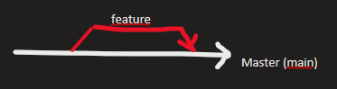

# 📖 Version Control

## **Introduction**

### What is a version control?

* #### Source control

Practica para gestionar cualquier software

* #### Track and manages changes

Permite ayudar a la corrección de código

Minimiza interrupciones al equipo

* #### Complete history

Muestra de los cambios realizados (por persona y por código)

Cambios realizados a lo largo del tiempo

* #### Rollback

Commit - cambio en algún punto del tiempo, es el punto de partida para realizar un roleback

Podemos decidir a que commit regresar en caso de errores.

<mark style="color:blue;">Git</mark> se maneja como un árbol conformado por ramas, cada rama es una copia del tronco principal sobre la cual podemos hacer cambios.&#x20;

<figure><figcaption></figcaption></figure>

### Benefits of version control

* #### Full long term change history&#x20;

Creación, Modificación, Eliminación de archivos (cambios)

Movimiento de archivos, autor, fecha y notas del propósito de cada cambio (comando deggit?)

* #### Branching and Merging

Git se especializa en ramificaciones, a partir de ello los miembros del equipo pueden trabajar a partir del mismo archivo? y trabajar en flujos independientes.

Branch, trabajar en un flujo independiente sin modificar la rama principal.&#x20;

Merge - Una subrama puede regresar a la principal, <mark style="color:purple;">cuando ya esta terminado</mark>

* #### Traceability

Jira - Todo el trabajo de un proyecto, con boards y tickets? &#x20;

En los boards&#x20;

## Basic Configuration

### Instalación de git

Dado que al indicar el comando `sudo` siempre se pide contraseña del usuario se realiza lo siguiente:

```
sudo -i
visudo
```

Dentro del archivo buscar wheel y comentar <mark style="color:red;">Allow people in group wheel to run all comands</mark> y descomentar el <mark style="background-color:red;">same thing without password</mark>

Una vez realizado esto realizar:&#x20;

```
sudo dnf install git
```

&#x20;para instalar el gestor de paquetes dnf  (antes yum)

<mark style="background-color:yellow;">Si se realiza para Debian primero debe realizarse un</mark> <mark style="background-color:yellow;"></mark><mark style="background-color:yellow;">`apt-get update`</mark> <mark style="background-color:yellow;"></mark><mark style="background-color:yellow;">seguido de un</mark> <mark style="background-color:yellow;"></mark><mark style="background-color:yellow;">`apt-get install git`</mark>

Para comprobar que se instaló de manera correcta:&#x20;

```
git --version
```

### Configuración de Git

```
git config --global user.name “<usernameGitLab>”
```

```
git congif --global user.email “<emailGitLab>”
```

```
git config --global color.ui  true 
git config --global color.ui  <true|false> 
```

<pre><code>git config --global core.editor “&#x3C;vim|nano|pico>”

<strong>git config --global core.editor "vim"
</strong></code></pre>

Si no se tiene instalado vim usar:

```
sudo dnf install vim
```

## Basic Commands

Primero será necesario crear un nuevo proyecto y repositorio, al crear viene la configuración a realizar al igual que se realizó anteriormente.

En primer lugar debe clonarse el repositorio en la terminal para poder trabajar con el. <mark style="color:yellow;">Es importante clonar por medio de https y no ssh</mark>

```
git clone [aqui va el link]
```

y pide usuario y contraseña

Despues ingresamos al mismo

```
cd NombreRepo
```

Para observar las ramas o branches:

```
git branch -a
```

Para crear el branch principal se usa: (antes era master en lugar de main)

```
git switch --create main
```

Para crear y listar archivos

```
touch README.md
ls -l
```

Añadir los cambios del repositorio

```
git add README.md
```

Realizamos un commit, `-m` es para describir con un mensaje los que se realiza en el commit

```
git commit -m 'Initial commit'
```

Para darle push, es decir añadir los cambios realizaods al repositorio remoto,  a nuevas ramas. La bandera --set-upstream se usa solo cuando tenemos ramas que aún no se encuentren (que con nuevas) en el repositorio remoto.

<mark style="color:yellow;">Push solo es de local a remoto.</mark>

```
git push --set-upstream origin main
```

### <mark style="background-color:red;">¿Cómo verificar el historial de commit?</mark>

En la interfaz gráfica de GitLab:

En Code -> Commits: se muestra un codigo (SHA) numero que identifica a cada commit y poder realizar rollbacks o hacer referencia a los commit

En Code -> Repository graph

En la terminal:

```
git log
```

Se muestra como:

<figure><figcaption><p>Ejemplo de gitlog con el commit, Autor y Fecha.</p></figcaption></figure>

También se puede ver de manera gráfica con el comando

```
git log --graph --oneline
```

<figure><figcaption><p>Ejemplo de salida de git log de manera gráfica.</p></figcaption></figure>

#### Revertir cambios a nivel local

Suponiendo que añadimos el archivo file1.txt pero decidimos no subir ese archivo al commit se realiza el reset como se muestra a continuación:

<pre><code>touch file1.txt
<strong>git add file1.txt
</strong>git reset HEAD file1.txt
git commit -m 'Test' 
</code></pre>

Touch modifica la marca de tiempo mtime. Existen 3 marcas de tiempo:&#x20;

<figure><figcaption><p>Resultado obtenido.</p></figcaption></figure>

Realizando otro commit:

```
git add file1.txt
git commit -m 'Add file1.txt'
git push
```

#### Revertir cambios a nivel remoto (en commit)

Revertir un commit: (min 40?)

```
git log
git revert Numerocommit
:wq

ls -l

git log
```

revertir el revertir?

Hay otra forma de realizarlo, para ello se usa la bandera Hard:

```
git reset --hard commitnumerber
git push
```

¿Cómo

Para saber la rama en la que se esta trabajando.

```
git branch
```

Creación para una nueva rama, tipo de rama + descripción

```
git checkout -b feature/create-app
git branch 
```

Sin la bandera sirve para cambiar entre ramas, si no existe marca error:

```
git checkout <branch>
```

Para ver todas las ramas:

```
git branch -a
```

Para cambiar el nombre de una rama

```
git branch -n branch_old branch_new
```

Para ver el historial del commits

```
git log branch
```

Rama hash, autor y modificacions


NOTA:

```
git commit -m "feat: POC-FeatureID, breve descripción"

git commit -m "feat: POC-1322, change module"
```


## Collaborative Work&#x20;

Ants de realizar cambios al repositorio es necesario realizar sincronizaci{on de la remota a local.

Primero cambiarse a la rama main y realizar pull:

```
git pull
git pull origin
```

PAra&#x20;


Fusi{on, pull request o merge request

Interfz gr{afica


Merge request -> new mrge request


Get the status from the remote repository

```
git status
```

Get the changes from the remote repository

```
git pull origin <branch_name>
```

Upload changes to the remote repository

```
git add
git commit -m ‘<commit_msg>’
git push origin <branch_name>
```

Create a merge request

[https://docs.gitlab.com/ee/user/project/merge\_requests/creating\_merge\_requests.html](https://docs.gitlab.com/ee/user/project/merge\_requests/creating\_merge\_requests.html)

\



**Good to know:** GitBook is a great place to document your team's meetings, giving folks access to documentation from every meeting. This template is structured in a way that gives collaborative, open note-taking centre stage. There's no reason why you can't use it for private or personal meeting notes though!

